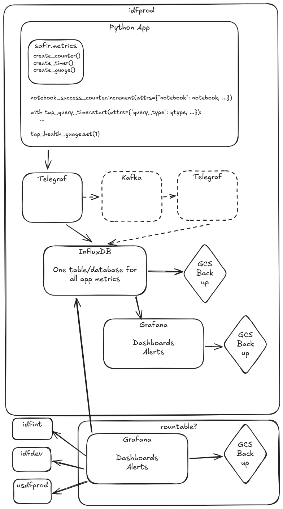

# Towards a metrics harness for Phalanx applications

```{abstract}
This technote describes considerations towards obtaining semantically rich data collected from instrumented phalanx applications. 
```

## Add content here

See the [Documenteer documentation](https://documenteer.lsst.io/technotes/index.html) for tips on how to write and configure your new technote.

## Why not OpenTelemetry (OTel)?

*TLDR:* If we use InfluxDB, we can't use OTel.

[OpenTelemetry](https://opentelemetry.io/) is an open protocal that describes a way for applications to communicate three different kinds, or [signals](https://opentelemetry.io/docs/concepts/signals/), of telemetry data:
* Traces
* Metrics
* Logs

There are SDKs in all popular programming languages (including Python and JavaScript) to instrument applications to generate data, and many databases and vendors support ingesting the data (including InfluxDB v2 and v3).
In theory, we can instrument our applications using these SDKs, and easily have the data end up in any supported backend.
For the initial implementation of application metrics, as described in [SQR-061](https://sqr-061.lsst.io/#appendix-monitoring-targets), we're mainly interested in instrumenting the [Metrics signal](https://opentelemetry.io/docs/concepts/signals/metrics/).

OTel metrics and the querying capabilities of InfluxDB (all versions) are fundamentally incompatible.
The InfluxDB database and metric writing protocol is based around individual metric events, each with a single value and a single timestamp.
Any aggregation of those values happens downstream of the instrumented application; maybe in a Telegraf collector, and almost certainly at query time.
OTel, however, explicitly expects aggregation to happen in the instrumented application (via the OTel SDK), and it expects any backend databases to be able to handle queries over this pre-aggregated data.

For example, to record the number of requests to a given handler, the idiomatic OTel instrument is a Counter.
In the handler function, we'd have something like this:
```python
my_handler_counter.add(1)
```

Instead of sending one event with a value of `1` to the backend, it will be cached in the application process. Periodically (on a separate thread in the Python SDK), the SDK will add up all of these measurements that have occured since the last aggregation, add it to the last aggregated value, and send this aggregate number that will be sent to the backend.
If you just graph this value in Chronograf/Grafana:

```
SELECT "counter" AS "sum_counter"
FROM "gafaelfawr"."autogen"."login.attempts"
WHERE time > :dashboardTime:
AND time < :upperDashboardTime:
```

you'll see a steadily increasing line, with sudden drops every time the application is restarted.
In order to get the number of those events that happened per time window, which is what you probably want, you need to use the `DIFFERENCE` [function](https://docs.influxdata.com/influxdb/v1/query_language/functions/#difference):

```
SELECT DIFFERENCE(sum("counter")) AS "difference_counter"
FROM "gafaelfawr"."autogen"."login.attempts"
WHERE time > :dashboardTime: AND time < :upperDashboardTime:
GROUP BY time(:interval:)
FILL(null)
```
But that doesn't work across resets.
I (Dan) am not sure what the correct query is.

Another even more troubling example is recording the duration of some application code.
The idomatic OTel instrument to record duration is a Histogram, and it would look something like this, using the Python SDK:
```
my_handler_histogram.record(456)  # milliseconds
```
The [default Histogram aggregation](https://opentelemetry-python.readthedocs.io/en/latest/sdk/metrics.view.html#opentelemetry.sdk.metrics.view.ExplicitBucketHistogramAggregation) will record these aggregations of the values seen in the recording window:
* The sum of the values
* The number of measurements
* The number of measurements that fell into each pre-configured bucket
* The maximum value (though this is not supported by many backends, including InfluxDB)
* The minimum value (though this is not supported by many backends, including InfluxDB)

This means that, aside from the min and max values, we do not send _any_ of the actual values that we saw to the backend.
In the case of the InfluxDB backend, [those are the exact measurements that we get](https://github.com/influxdata/influxdb-observability/blob/main/docs/metrics.md#histogram-metric).
There is no built-in support for querying quantiles from those metrics.
Other backends (Like [Prometheus](https://prometheus.io/)) natively provide ways to query quantile and other information from values that are stored like this.
They deal with the lack of explicit values by estimating the distribution of values in each bucket.
Prometheus [estimates a linear distribution](https://prometheus.io/docs/practices/histograms/#errors-of-quantile-estimation), for example.

To query percentiles from this data as it is stored in InfluxDB, we would have to write that estimation logic into the queries themselves.
I (Dan) don't know how we would do that, and neither does anyone else, it seems.

[This writeup from TimescaleDB](https://www.timescale.com/blog/a-deep-dive-into-open-telemetry-metrics/) is a great and more in-depth description of how OTel metrics collected and aggregated.

## Architecture
This is a simplified version of [SQR-061](https://sqr-061.lsst.io/).
It is basically just telegraf and Influx, and none of the [rubin-influx-tools](https://github.com/lsst-sqre/rubin-influx-tools/) tooling.
*NOTE:* This proposal does not cover monitoring on Kubertes-based telemetry like pod restarts.
* There is separate infrastructure in every environment, rather than a centralized infratsructure to serve all environments (except for maybe a centralized Grafana with access to all environemnts).
* All app metrics go to the same database/bucket, which eliminates the need for BucketMaker and TokenMaker
* All alerting is done by Grafana
* There are no common alerts among all apps, which eliminates the need for taskmaker. In a future where kubernetes-based monitoring is also handled by this system, we'll probably want something like taskmaker to install the common alerts into Grafana.
* All Grafana config is backed up continuously, if we need to restore dashboards or alerts, we can get them from a backup.



### Python App Client
This architecture includes a custom Python SDK that exposes an OTel-SDK-like interface for instrumenting apps Python apps.
This would initially be a wrapper around the InfluxDB SDK, but we could theoretically switch to OTel metrics with few or no changes to app code.

### Kafka
Kafka is optional in this architecture, and it can be added via Telegraf without any changes to app instrumentation.
Reasons why we might want to add it later:
* We are concerned with the availability of the Influx DB
* We are sending metrics at too high a rate for the Influx DB to ingest them and Telegraf starts dropping metrics
  * In this case, Telegraf is soon getting [disk buffering](https://github.com/influxdata/telegraf/pull/15564), so we could potentially use that as a lighter-weight solution.
I (Dan) suggest we start without Kafka and reconsider only if we experience the above issues.

### Why Not Sasquatch?
We already have a durable and reliable system to ingest a large volume of metrics into InfluxDB, so why don't we just use that for app metrics?
Because many of the things that Sasquatch does that make it a great fit for telescope telemetry and pipeline metrics require some degree of developer overhead, and application metrics do not need the additional benefits that we get from that effort.
* Sasquatch currently requires tags for metrics to be defined in phalanx.
  App metric tags will likely change much more frequently than metrics for other current Sasquatch usecases, and coordinating with Phalanx every time this happens is too much overhead.
* We would have to write our own logic to asynchronously batch and ship metrics reliably.
  This is functionality we get out of the box with the Influx python sdks (and OTel SDKs if we ever use them).
  * Though the python kafka clients are pretty resilient and handle batching and cleanup if we write directly to Kafka


## Dashboard Caching
* https://github.com/trickstercache/trickster

## Long-term retention
* How long? Forever.
* Adds to the argument for using a different backend that supports tiered storage and/or cloud object store support.
